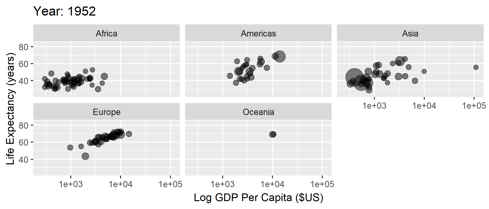
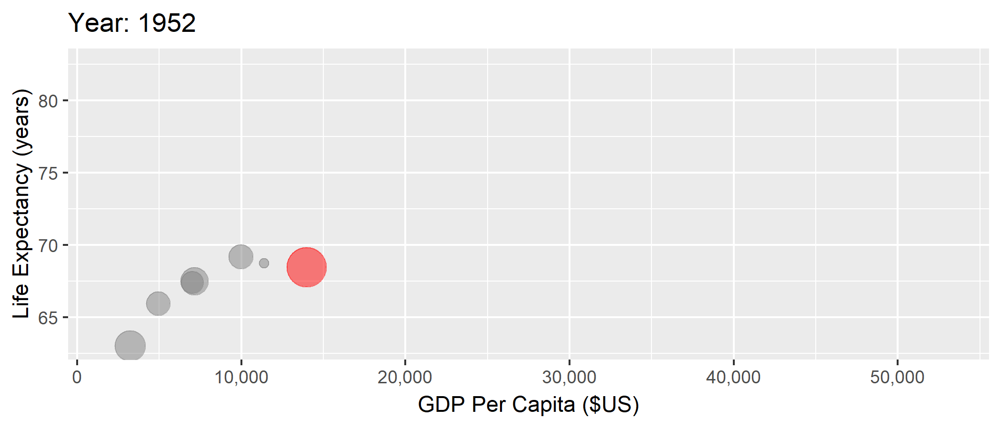

<!-- Adjust some CSS code for font size and maintain R code font size -->
<style type="text/css">
.remark-slide-content {
    font-size: 30px;
    padding: 1em 2em 1em 2em;    
}
.remark-code, .remark-inline-code { 
    font-size: 20px;
}
</style>


<!-- Set R options for how code chunks are displayed and load packages -->
```{r setup, include=FALSE}
options(htmltools.dir.version = FALSE)
library(knitr)
opts_chunk$set(
  fig.align="center",  
  fig.height=3, #fig.width=6,
  # out.width="748px", #out.length="520.75px",
  dpi=300, #fig.path='Figs/',
  cache=T#, echo=F, warning=F, message=F
  )

knitr::opts_hooks$set(fig.callout = function(options) {
  if(options$fig.callout) {
    options$echo = FALSE
  }
  options
})

if (!require("pacman")) install.packages("pacman")
pacman::p_load(tidyverse, ggplot2, dplyr, lubridate, readr, readxl, hrbrthemes,
               scales, gganimate, gapminder, gifski, png, tufte, plotly, OECD,
               ggrepel)
```


# Table of contents

1. [Motivation](#welcome)

2. [Course overview](#syllabus)

3. [U.S. health care](#us_health)

<!-- New Section -->
---
class: inverse, center, middle
name: welcome

# Motivation

<html><div style='float:left'></div><hr color='#EB811B' size=1px width=1055px></html>


---
# Health and Health Care

<br>
.center[
  
]

---
# Health and Health Care

We've made *major* improvements in life expectancy (and many other measures of health) across the world

- Poverty reduction
- Technology development and innovation
- Technology diffusion and adoption
- Access to better services, including health care


---
# Evidence of better health

```{r life-exp, eval=FALSE}
library(gapminder)
gapminder %>%
  group_by(year) %>%
  summarize(lifeExp = median(lifeExp),
            gdpMed = median(gdpPercap)) %>%
  ggplot(aes(year,lifeExp)) + geom_line(alpha = 1/3) + theme_bw() +
    labs(x = "Year",
         y = "Life Expectancy (years)",
         title = "Median life expectancy across the world")

```
.plot-callout[
```{r life-exp-callout, ref.label="life-exp", fig.callout=TRUE}
```
]


---
# Evidence of better health

```{r life-exp-full-output, ref.label="life-exp", fig.callout=TRUE}
```


---
# GDP and Health

```{r lifexp-gdp, eval=FALSE}
library(gapminder)
ggplot(data = gapminder, mapping = aes(x = gdpPercap, y = lifeExp)) + 
  geom_point(size = 1) + theme_bw() + scale_x_continuous(label = comma) +
  labs(x = "GDP Per Capita ($US)",
       y = "Life Expectancy (years)",
       title = "Life expectancy and GDP")
```
.plot-callout[
```{r lifexp-gdp-callout, ref.label="lifexp-gdp", fig.callout=TRUE}
```
]


---
# GDP and Health

```{r lifexp-full-output, ref.label="lifexp-gdp", fig.callout=TRUE}
```


---
# GDP and Health over Time

```{r gganim1, message=FALSE, warning=FALSE, include=FALSE}
anim1 <- ggplot(gapminder, aes(gdpPercap, lifeExp, size = pop)) +
  geom_point(alpha = 0.5, show.legend = FALSE) +
  scale_colour_manual(values = country_colors) +
  scale_size(range = c(2, 12)) +
  scale_x_log10() +
  facet_wrap(~continent) +
  labs(title = 'Year: {frame_time}', x = 'Log GDP Per Capita ($US)', y = 'Life Expectancy (years)') +
  transition_time(year) +
  ease_aes('linear')

anim_save("anim1.gif",anim1,
          path="D:/CloudStation/Professional/Teaching Material/Emory/Econ 372 - Health Care Markets/01-Introduction/pics")
```

.center[
  
]


---
# But the US is unique
```{r us-gap, message=FALSE, warning=FALSE, include=FALSE}
mycolors <- c("US" = "red", "other" = "grey50")
anim2 <- gapminder %>% filter(country %in% c("Canada", "France", "Germany", "Italy", "Japan", "United Kingdom", "United States")) %>%
  mutate(highlight = ifelse(country=="United States", "US", "other")) %>%
  ggplot(aes(gdpPercap, lifeExp, size = pop)) +
  geom_point(alpha = 0.5, show.legend = FALSE, aes(color=highlight)) +
  scale_color_manual("U.S.", values = mycolors) +
  scale_size(range = c(2, 12)) +
  scale_x_comma(limits=c(0,55000)) + 
  labs(title = 'Year: {frame_time}', x = 'GDP Per Capita ($US)', y = 'Life Expectancy (years)') +
  transition_time(year) +
  ease_aes('linear')

anim_save("anim2.gif",anim2,
          path="D:/CloudStation/Professional/Teaching Material/Emory/Econ 372 - Health Care Markets/01-Introduction/pics")
```

.center[
  
]


---
# Health care spending
```{r include=FALSE}
search_dataset("health",get_datasets())
oecd.str1 <- get_data_structure("SHA")
oecd.str2 <- get_data_structure("HEALTH_STAT")
oecd.exp <- get_dataset("SHA", filter=list("HFTOT", "HCTOT", "HPTOT", "PARPIB"))
oecd.health <- get_dataset("HEALTH_STAT", filter=list(c("MATIINFA","MATIMATM")))

health.dat <- oecd.health %>%
  filter(COU %in% c("USA", "GBR", "CAN", "FRA", "DEU", "ITA", "JPN")) %>%
  select(VAR, year = obsTime, value = obsValue, country = COU)
health.dat <- pivot_wider(health.dat, id_cols = c("year", "country"),
                          names_from = VAR, 
                          values_from = value) %>%
  rename(mort_inf = MATIINFA, mort_mat = MATIMATM)

exp.dat <- oecd.exp %>%
  filter(LOCATION %in% c("USA", "GBR", "CAN", "FRA", "DEU", "ITA", "JPN")) %>%
  select(year = obsTime, tot_exp = obsValue, country = LOCATION)

oecd.dat <- health.dat %>%
  left_join(exp.dat, by=c("year", "country")) %>%
  mutate(year=as.integer(year))

```

```{r spend, echo=FALSE}
oecd.dat %>% filter(year>=1970) %>%
  ggplot(aes(x=year,y=tot_exp,color=country)) + 
  geom_line(show.legend = FALSE) + theme_bw() +
  geom_text_repel(data = oecd.dat %>% filter(year == 2014), 
            aes(label = country,
                x = year + 1,
                y = tot_exp),
            show.legend = FALSE) +
  guides(linecolor=FALSE) +
  labs(
    x="Year",
    y="Spending as Share of GDP",
    title="Health Care Spending over Time"
  ) + xlim(1970, 2017)
```


---
# Spending and infant mortality
```{r spend-inf-mort, message=FALSE, warning=FALSE, include=FALSE}
anim4 <- oecd.dat %>% filter(year>=1970) %>% group_by(country) %>% fill(c(tot_exp, mort_inf), .direction="updown") %>%
  ggplot(aes(tot_exp, mort_inf, label=country)) +
  geom_text(aes(size=3), show.legend=FALSE) + theme_bw() + 
  labs(title = 'Year: {frame_time}', x = 'Health Care Spending (%GDP)', y = 'Infant Mortality') +
  transition_time(year) +
  ease_aes('linear')
anim_save("anim4.gif",anim4,
          path="D:/CloudStation/Professional/Teaching Material/Emory/Econ 372 - Health Care Markets/01-Introduction/pics")
```

.center[
  
]


---
# Spending and maternal mortality
```{r spend-mat-mort, message=FALSE, warning=FALSE, include=FALSE}
anim5 <- oecd.dat %>% filter(year>=1970 & year<=2012) %>% group_by(country) %>% fill(c(tot_exp, mort_mat), .direction="updown") %>%
  ggplot(aes(tot_exp, mort_mat, label=country)) +
  geom_text(aes(size=3), show.legend=FALSE) + theme_bw() + 
  labs(title = 'Year: {frame_time}', x = 'Health Care Spending (%GDP)', y = 'Maternal Mortality') +
  transition_time(year) +
  ease_aes('linear')
anim_save("anim5.gif",anim5,
          path="D:/CloudStation/Professional/Teaching Material/Emory/Econ 372 - Health Care Markets/01-Introduction/pics")
```

.center[
  
]


---
# Why study U.S. health care

1. Health and health care are constantly changing

2. <span>&#36;</span>3.5 trillion, 17.9% of GDP, <span>&#36;</span>10,739 per person

3. U.S. health care is uniquely inefficient in many ways

--

> *"Nobody knew health care could be so complicated"*
> `r tufte::quote_footer('-- Donald Trump')`


<!-- New Section -->
---
class: inverse, center, middle
name: syllabus

# Course overview

<html><div style='float:left'></div><hr color='#EB811B' size=1px width=1055px></html>

(Read the full document [here](https://github.com/imccart/Econ-372/blob/master/Syllabus/Econ372-Syllabus.pdf).)

---
# Goals of this course
1. Explain structure of U.S. health care system

2. Model adverse selection in health insurance

3. Explain physician agency problem and the role of financial incentives in health care

4. Analyze hospital data in real-life setting


---
# Structure
Material typically presented as follows:

1. Traditional lecture and discussion
  - All readings listed in syllabus
  - Available on course website or *Canvas* if not publicly available
2. In-class worksheets
3. Homework
4. Exam (mid-term only)


---
# Assignments

- Homework (x3)

- Mid-term

- Case Study

- Policy discussion


---
# Grading

 Component     | Weight
 --------------| ------------
 Homework (x3) | 45% 
 Mid-term      | 20%
 Case Study    | 30%
 Discussion    | 5%


---
# Some expectations
- This is an <b>economics</b> class first
- Need some calculus to think things through formally
  - Nothing more than derivatives
  - For review, see [practice problems](practice_problems.pdf) and [solutions](practice_poblems_solutions.pdf)
  - If you can do this review, you're in good shape

<!-- New Section -->
---
class: inverse, center, middle
name: us_health

# U.S. Health Care

<html><div style='float:left'></div><hr color='#EB811B' size=1px width=1055px></html>


---
# Health Care and Economics (in General)
Lots of interesting economic issues in health care (not all unique to the U.S.):
1. Extremely heterogeneous products
2. Asymmetric information between patients and physicians
3. Unobservable quality (experience good)
4. Unpredictable need (inability to shop in many cases)
5. Distortion of incentives due to insurance
6. Adverse selection (asymmetric information between patients and insurers)


---
# How is the U.S. unique
- These factors exist in other markets and in other countries, but...
- Health care is unique in the combination of these issues
- U.S. is unique in the extent of these issues in health care (policy problems)


---
# Why?

Can you identify one or two reasons for our high prices/expenditures? Keep in mind we don't have a particularly strong quality advantage either.


---
# Why is spending so high?

.center[
<iframe width="560" height="315" src="https://www.youtube.com/embed/qSjGouBmo0M" frameborder="0" allow="accelerometer; autoplay; encrypted-media; gyroscope; picture-in-picture" allowfullscreen></iframe>
]

---
# Fragmentation
A common crticism of U.S. health care is that it is extremely fragmented:
- different ways to get insurance
- mix of providers and reliance on referrals
- separate billing (for the most part)

---
# Complicated bills
Our fragmented system has led to a ridiculously complex and convoluted billing process

--

.center[
  
]

<div class="smalltext">Brill, Steven. 2013. "Bitter Pill: Why Medical Bills are Killing Us." *Time Magazine*.</div>

---
# Complicated bills
- $18 for accu-chek test strip (in 2011)
- Can get 50 for $11.44 on Amazon<br>

--
<br>

Note: this $18 is a charge, which is different from price or cost...much more on this later


---
# What did we learn?
1. We spent *LOTS* on health care, the most in the world by far
2. Definitely not the highest quality health care system in the world
3. Many reasons:
  - Standard health economics issues
  - Fragmented system
  - Market-based system but without real competition
  - Policy failures
4. What's the solution?<br>

--

Take this class!!
