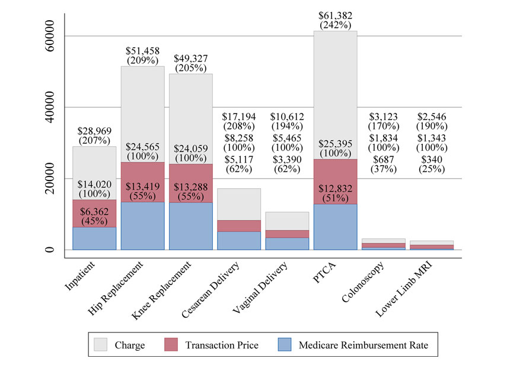
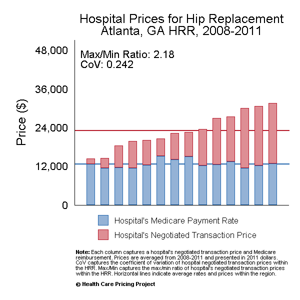
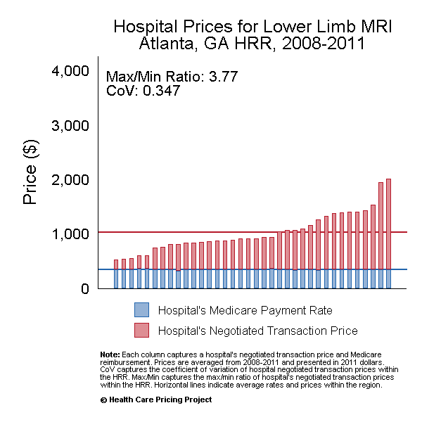

<!-- Adjust some CSS code for font size and maintain R code font size -->
<style type="text/css">
.remark-slide-content {
    font-size: 30px;
    padding: 1em 2em 1em 2em;    
}
.remark-code, .remark-inline-code { 
    font-size: 20px;
}
</style>


<!-- Set R options for how code chunks are displayed and load packages -->
```{r setup, include=FALSE}
options(htmltools.dir.version = FALSE)
library(knitr)
opts_chunk$set(
  fig.align="center",  
  fig.height=3, #fig.width=6,
  # out.width="748px", #out.length="520.75px",
  dpi=300, #fig.path='Figs/',
  cache=T#, echo=F, warning=F, message=F
  )

knitr::opts_hooks$set(fig.callout = function(options) {
  if(options$fig.callout) {
    options$echo = FALSE
  }
  options
})

if (!require("pacman")) install.packages("pacman")
pacman::p_load(tidyverse, ggplot2, dplyr, lubridate, readr, readxl, hrbrthemes,
               scales, gganimate, gapminder, gifski, png, tufte, plotly, OECD,
               ggrepel, survey, foreign, devtools, pdftools)
```


# Table of contents

1. [Motivation](#motivate)

2. [What Do Hospitals Maximize?](#objective)

3. [Pricing and Negotiations](#pricing)

4. [Fixed Prices](#public)

5. [Two Prices](#twoprice)

5. [Current Policy Issues](#policy)


<!-- New Section -->
---
class: inverse, center, middle
name: motivate

# Motivation

<html><div style='float:left'></div><hr color='#EB811B' size=1px width=1055px></html>


---
# Institutional background

- Before 1900: Just don't go to the hospital! (at least in the U.S.)
  - mainly charity care
  - hospitals were a learning experience for physicians

- Early 1900s: big safety and technological improvements

- Mid 1900s: huge growth, especially in wealthy and urban areas
  - Medicare and Medicaid in 1965 (Social Security Act)

---
# Now
As we know, we now spend <b>a lot</b> on health care in the U.S., and a big part of that is very high health care prices. (and a big part of that is hospital prices)


---
# What is a hospital price?

Defining characteristic of hospital services: *it's complicated!*

--
.center[
  
]

<div class="smalltext">Brill, Steven. 2013. "Bitter Pill: Why Medical Bills are Killing Us." *Time Magazine*.</div>

---
# What is a hospital price?

Lots of different payers paying lots of different prices:
- [Medicare fee-for-service prices](https://www.cms.gov/Outreach-and-Education/Medicare-Learning-Network-MLN/MLNProducts/Downloads/AcutePaymtSysfctsht.pdf)
- [Medicaid payments](https://www.kff.org/report-section/understanding-medicaid-hospital-payments-and-the-impact-of-recent-policy-changes-issue-brief/)
- Private insurance negotiations (including Medicare Advantage)
- But what about the price to patients?

--

.center[
Price $\neq$ charge $\neq$ cost $\neq$ patient out-of-pocket spending
]

---
# What is a hospital price?

.center[
  
]

<div class="smalltext">Source: <a href="https://healthcarepricingproject.org/">Health Care Pricing Project</a></div>


---
# What is a hospital price?
Not clear what exactly is negotiated...

--
.pull-left[
### Fee-for-service
- price per procedure
- percentage of charges
- markup over Medicare rates
]

--
.pull-right[
### Capitation
- payment per patient
- pay-for-performance
- shared savings
]

---
# Hospital prices in real life
We'll get into the real data in a bit, but for now...a few facts:

1. Hospital services are expensive

2. Prices vary dramatically across different areas

3. Lack of competition is a major reason for high prices

---
# Hospital prices in real life

.pull-left[
  
]

.pull-right[
  
]

<div class="smalltext">Source: <a href="https://healthcarepricingproject.org/">Health Care Pricing Project</a></div>


<!-- New Section -->
---
class: inverse, center, middle
name: objective

# What Do Hospital's Maximize?

<html><div style='float:left'></div><hr color='#EB811B' size=1px width=1055px></html>

---
# Ownership types

1. Private not-for-profit: About 60%

2. For-profit: About 20%

3. State and local gov't: About 20%

<br>
<div class="smalltext">Source: <a href="https://www.aha.org/statistics/fast-facts-us-hospitals">AHA Fast Facts</a></div>

---
# Non-profit hospitals
What does it mean to be a not-for-profit hospital?<br>

--

From an economics perspective:
- Hospital assumed to maximize some objective function, $u(q,z)$, subject to a production constraint

- $q$ denotes quantity of care and $z$ denotes quality of care

- Production is constrained by the break-even condition

---
# Non-profit hospitals
What does it mean to be a not-for-profit hospital?<br>

--

From a practical perspective:
- Profits must be re-invested into the hospital

- Must show "community benefit" (no consensus definition...includes uncompensated care, services to Medicaid, and certain specialized services that are generally unprofitable)

- No taxes! and tax-free bonds

---
# Non-profit hospitals and tax benefits
- <span>&#36;</span>24.6 billion in tax exemptions in 2011

- <span>&#36;</span>62.4 billion in "community benefits"<br>

- [Washington Post Article](https://www.washingtonpost.com/national/health-science/value-of-tax-breaks-for-nonprofit-hospitals-doubled-in-a-decade/2015/06/17/4162c640-1450-11e5-9ddc-e3353542100c_story.html?utm_term=.4f877a72a09f)<br>

--

What do you think? Are these community benefits measured appropriately?


---
# What is a non-profit hospital?
The real question is...what is the hospital's objective function?

- For-profit in disguise
- Output maximizers
- Tax-benefit maximizers
- Social welfare maximizers<br>

--

Most empirical evidence doesn't find much of a difference between FP and NFP hospitals, except FPs have higher prices. Why is that?


---
# For-profit hospitals
These are easier to study theoretically...just a standard profit maximizing firm.

- $\pi=P(q)q - C(q),$ where $q$ denotes quantity of care

- Firm has some market power and so faces a downward sloping demand curve


<!-- New Section -->
---
class: inverse, center, middle
name: pricing

# Pricing and Negotiations

<html><div style='float:left'></div><hr color='#EB811B' size=1px width=1055px></html>


---
# Pricing for NFP hospitals
Objective is to maximize some function of profits and quantity of care provided, denoted by<br>

$U\left( \pi_{j} = \pi_{i,j} + \pi_{g,j},D_{i,j}, D_{g,j} \right)$<br>

where $\pi_{j}$ denotes total profits for hospital $j$ and $D_{i,j}$ denotes hospital demand from insurer $i$. We assume that $p_{j}$ is exogenous and determined by a public payer, so the hospital need only set its price for private insurance customers, $p_{i}$.

---
# Solution for NFP hospital
The hospital chooses $p_{i}$ such that<br>

$\frac{\mathrm{d}U}{\mathrm{d}p_{i}} = U_{1} \pi_{1}^{i} + U_{2} \frac{\mathrm{d}D_{i}}{\mathrm{d}p_{i}}=0$,<br>

where $U_{1}$ denotes the derivative of $U(\cdot)$ with respect to its first argument and similarly for $U_{2}$.<br>

--

In general, we can't solve this directly without knowing the hospital's utility function. 


---
# Assuming pure profit maximization
```{tikz echo=FALSE, fig.ext='png', cache=TRUE, tikz-fp-pricing}
\usetikzlibrary{calc}
\begin{tikzpicture}[scale=0.40, every node/.style={black,opacity=1, transform shape}]
\draw [thick](0,9) node [left,align=center] {\small Costs and\\ \small Revenue} -- (0,0) node [below left] {$0$} -- (10,0) node [below, align=center] {\small Quantity};
\draw [thick, blue!90](0,7)-- (8,2)node[right, black, align=center]{\small Demand};
\draw [thick, purple!90](0,7)-- (6,1)node[black, right]{\small Marginal Revenue};
\draw [thick, blue!90](1,4) to [out=300, in=240] (7,5)node[right,black]{\small Average total cost};
\draw [thick, purple!90](2,1) node[black, left, align=center]{\small Marginal \\cost}--(5.25, 6);
\draw[fill] (3.6,3.4) node[right] {$A$} circle [radius=0.1];
\draw[fill] (3.6,4.75) node[above] {$B$} circle [radius=0.1];
\draw[dashed](0,4.75) node[left, align=center]{\small Monopoly\\ \small price}--(3.6,4.75)--(3.6,0)node[below]{$q^{*}$};
\end{tikzpicture}
```

---
# Example

Consider the firm's demand curve, $d=16-q$, and cost curve, $c(q)=5+q^{2}$. Where will the firm produce and at what price? What is the firm's markup over marginal cost?


---
# Negotiating with insurers
- Hospitals can't set price on their own
- Negotiation with insurers
- Bargaining problem where insurer and hospital split some total amount
- Agent/entity with higher bargaining position will get larger share

--
# Understanding the outside option
Key part of understanding effect on price is to understand the "outside option". What does this mean?<br>

--

Outside option in this case is the profit to the hospital or insurer if a negotiation "breaks down". What is the outside option to an insurer if they are in a monopoly hospital market?


<!-- New Section -->
---
class: inverse, center, middle
name: public

# Fixed Prices

<html><div style='float:left'></div><hr color='#EB811B' size=1px width=1055px></html>


---
# Types of fixed prices
- Health care providers also face a fixed price from Medicare and Medicaid
- Variation across hospitals, but hospital has no control over it's individual price


---
# Background on Medicare
- Created by the Social Security Act in 1965
- Originally health insurance to those 65 years of age and older
- Expanded to include certain disabilities (20% now below age 65)
- Consists of four parts:
  1. Part A: Hospital Insurance
  2. Part B: "Medical" Insurance (physician visits and outpatient care)
  3. Part C: Private supplemental care (Medicare plus Choice, now Medicare Advantage)
  4. Part D: Prescription Drug Coverage

---
# Medicare Part A
- Automatic enrollment for anyone 65 and older who worked over their lifetime
- Financed with combination of payroll tax (current workers) and cost-sharing (deductibles, etc.)
- Funds exist as part of "Federal Hospital Insurance Trust Fund"...can't finance through debt
- Benefit structure:
  - Very good for short inpatient stays
  - Very bad for major problems with long stays
  - Doesn't cover nursing home care beyond 30 days

---
# Medicare Part B
- Voluntary, but almost everyone enrolls
- Requires monthly premium ($144 in 2020)
- Small deductible and 20% co-insurance


---
# Medicare Part C
- Private insurance provision of Medicare benefits
- Formally created under Balanced Budget Act in 1997 (existed informally before)
- Heavily revised in Medicare Modernization Act in 2003
- Medicare pays insurers a risk-adjusted amount to enroll a given beneficiary
- Broader benefits than Part A and B, often with $0 additional premiums, but restrictive networks

---
# Medicare Part D
- Created under the Medicare Modernization Act in 2003
- Private insurance for prescription drugs
- Insurers receive payments from Medicare to enroll a given beneificiary (much like Part C)
- Many insurers offer a combined Part C+D plan

---
# Privatization of Medicare
- Medicare Advantage (both Parts C and D) has been well-received and generally thought to be a success story for Medicare benefits
- Accounts for nearly 40% of total Medicare enrollees
- Some early difficulties with adverse selection and risk-adjustment
- Still slightly sicker people staying in traditional Medicare
- Could be a <b>big</b> part of any future "Medicare-for-all" type program

---
# Medicare payments
- Prospective payment system
- Begin with two "base" rates:
  - Operating base payment rates, <span>&#36;</span>5,797 in 2020
  - Capital base payment rates, <span>&#36;</span>462 in 2020
- Adjustments:
  - Diagnosis Related Group (higher adjustments for more complicated things)
  - Academic Medical Center
  - Disproportionate Share


---
# Background on Medicaid
- Also created by the Social Security Act in 1965
- Originally provided health insurance to people receiving "Aid to Families with Dependent Children", mainly extremely poor families
- Expanded over time with different rules by state
- Huge program: about 40% of births are covered by Medicaid/CHIP and 1 in 3 birhts!

---
# ACA and Medicaid Expansion
- Big part of ACA was Medicaid expansion
- Originally mandatory but made voluntary by Supreme Court
- Expansion covers all adults (with or without children) below age 65 and with incomes below 138% of the federal poverty line ($35,535 for family of 4 in 2020)
  
---
# Medicaid Funding
- Paid for by states and federal funding
- State funding is matched by federal funds, and the match amount depends on the state's per capita income
- Incentivizes services to be provided by Medicaid that historically may not be

---
# Medicaid Benefits
- Pretty generous coverage
- Low to no copayments, deductibles, co-insurance
- Usually covers dental, vision, hospitals, and physician services
- Covers long term care (unlike Medicare). About 40% of all long term care is paid for by Medicaid.
- Growth in Medicaid managed care

---
# Medicaid Payments
- Works similarly to Medicare with a base rate plus adjustments
- Base rates vary by state Medicaid agencies
- Adjustments (or supplemental payments) consist of:
  - Disproportionate share adjustments 
  - Other (non-DSH) adjustments
  - Account for a little less than half of total Medicaid payments on average


<!-- New Section -->
---
class: inverse, center, middle
name: twoprice

# Two-price Market

<html><div style='float:left'></div><hr color='#EB811B' size=1px width=1055px></html>


---
# Relationship between prices
In health care, providers usually face two prices:

1. A price fixed by Medicare and Medicaid, $p_{m}$.
2. A price that is negotiated with insurers, $p_{n}$.

How does $p_{m}$ affect $p_{n}$?<br>

---
# Two price market and NFP
Although we don't know the general solution for the private price, we can find how it varies with the public price...<br>

--

$$\frac{\mathrm{d}p_{i}}{\mathrm{d}p_{j}} = - \frac{U_{11}\pi_{1}^{i}\pi_{1}^{j} + \frac{\mathrm{d}D_{i}}{\mathrm{d}p_{i}}U_{12}\pi_{1}^{j}}{\frac{\mathrm{d}^{2}U}{\mathrm{d}p_{i}^{2}}}$$

---
# Two price market and FP
.pull-left[
- Sell to "private" market as long as marginal revenue exceeds the public price
- Switch to "public'" market otherwise, and sell to the point where price equals marginal cost
]

.pull-right[
```{tikz echo=FALSE, fig.ext='png', cache=TRUE, tikz-fp-twoprice}
\usetikzlibrary{calc}
\begin{tikzpicture}[scale=0.40, every node/.style={black,opacity=1, transform shape}]
\draw [thick](0,9) node [left,align=center] {\small Costs and\\ \small Revenue} -- (0,0) node [below left] {$0$} -- (10,0) node [below, align=center] {\small Quantity};
\draw [thick, blue!90](0,7)-- (8,2)node[right, black, align=center]{\small Demand};
\draw [thick, purple!90](0,7)-- (4,1)node[black, right]{\small Marginal Revenue};
\draw [thick, purple!90](1.5,1) node[black, left, align=center]{\small Marginal \\cost}--(5.75, 6.5);
\draw (0,4) node[black, left]{$p_{m}$} -- (7,4);
\draw[fill] (2,4) node[above right] {$m$} circle [radius=0.1];
\draw[fill] (2,5.8) node[above right] {$n$} circle [radius=0.1];
\draw[fill] (3.8,4) node[below right] {$t$} circle [radius=0.1];
\draw[dashed](0,5.8) node[left, align=center]{$p_{n}$}--(2,5.8)--(2,0)node[below]{$q^{n}$};
\draw[dashed](3.8,0) node[below]{$q_{tot}$} -- (3.8,4);
\end{tikzpicture}
```
]

---
# Two price market example
Consider the firm's demand curve in the private insurance market, $d=16-q$, and costs, $c(q)=5+q^{2}$. Assume that there exists a public insurer that pays a fixed price of $\bar{p}=10$. How many private patients will the provider serve? How many public patients? What if $\bar{p}$ drops to <span>&#36;</span>9.

---
# Cost-shifting
- Relationship between public and private price is important
- Speaks to anticipated effects of a change in Medicaid or Medicare rates
- Do hospitals "make up" the difference?<br>

--

The idea that hospitals will increase private prices following a decrease in the public price is called <b>cost shifting</b>. 

---
# Cost-shifting
But how could it happen?<br>

--

Assumes that hospitals could have increased private prices earlier but chose not too. This is technically possible if, for example:
- Hospital has very low margins (maybe negative with a lower public price)
- Insurer wants to prop up the hospital for competitive reasons
- Hospital has diminishing returns to profits<br>

--

but economists usually see this as a smaller effect than most policy makers.


<!-- New Section -->
---
class: inverse, center, middle
name: policy

# Current Policy Issues

<html><div style='float:left'></div><hr color='#EB811B' size=1px width=1055px></html>

---
# Pay for performance
There are three main pay for performance programs employed in Medicare right now:
1. Hospital Readmission Reduction Program
2. Hospital Value Based Purchasing Program
3. [Quality Payment Program](https://qpp.cms.gov/about/qpp-overview) for physicians: Merit-based Incentive Payment System (MIPS) and Advanced Alternative Payment Models (APMs)

---
# Capitated Payments
There are two forms of capitated payments in Medicare now:
1. Bundled Payments
2. Accountable Care Organizations

